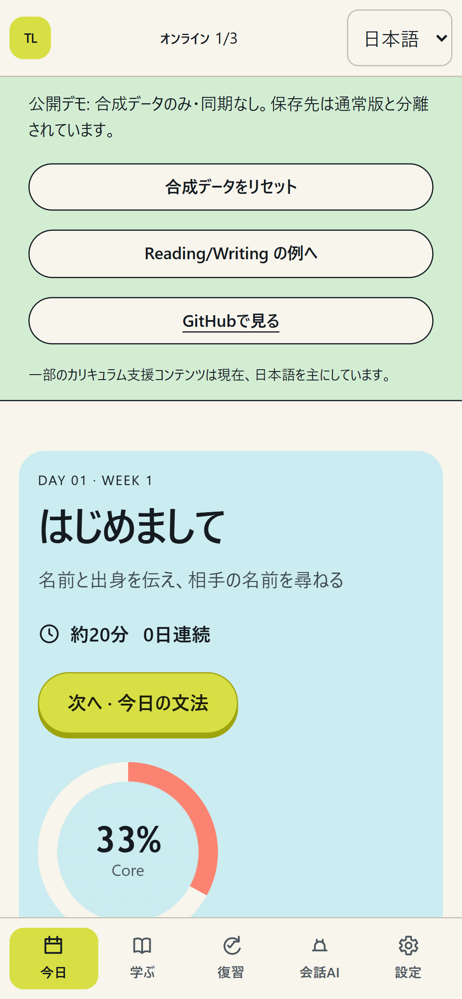
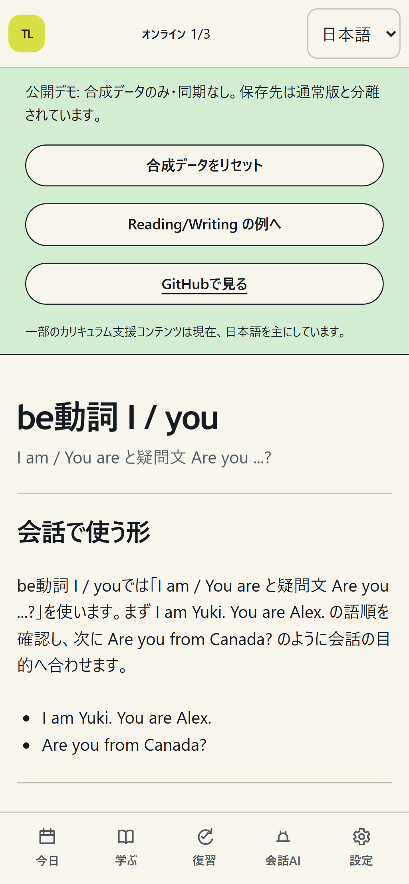
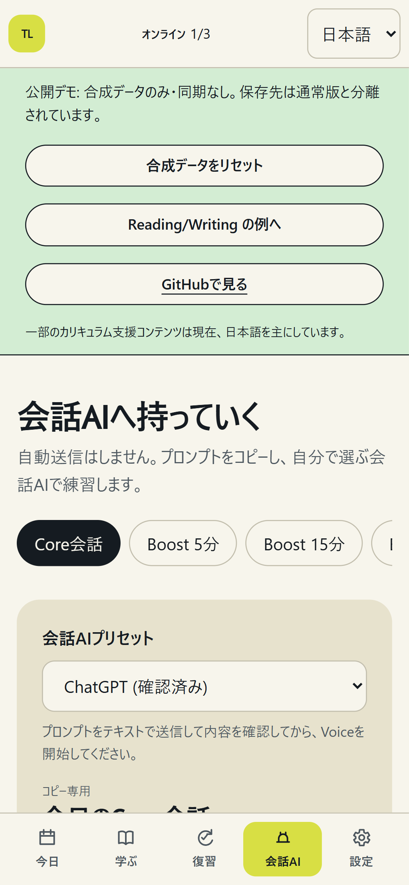
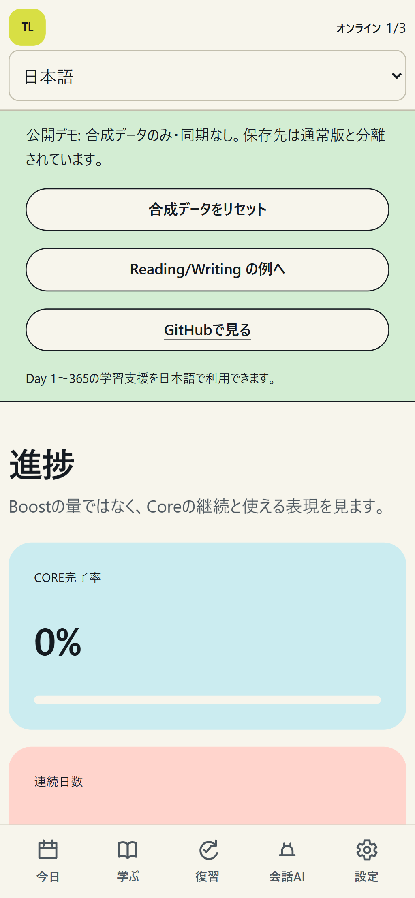
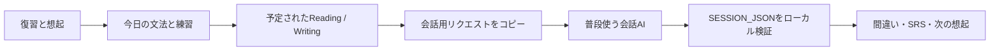

# Trellune（日本語）

**Trellune は、毎日の積み上げを支えるローカル優先の365日英語学習PWAです。**

カリキュラム、間隔反復、Grammar / Vocabulary、Reading / Writing、フィードバックと
再挑戦、Assessment、学習履歴をひとつの学習ループにまとめます。単なるAIチャットの
ラッパーではありません。使い慣れた会話AIへ学習リクエストをコピーし、返ってきた結果を
厳格に検証して取り込みます。AI APIキーは不要です。

[合成デモを試す](https://trellune-demo.pages.dev) · [しくみを見る](#しくみ) ·
[ローカルで試す](#ローカルで試す) · [貢献する](CONTRIBUTING.md)

| Today                                                                                    | Grammar / Practice                                                                  |
| ---------------------------------------------------------------------------------------- | ----------------------------------------------------------------------------------- |
|             |  |
| Conversation AI request                                                                  | Progress / SRS                                                                      |
|  |              |

すべての画像はリセット可能な合成デモから撮影しています。学習者データ、アカウント情報、
本番ホスト名、個人のブラウザ情報は含みません。英語UIの画像は
[English README](README.md) を参照してください。

## Trelluneでできること

- **365日カリキュラム:** Foundation / Independent / Fluency / B2 Challenge の4段階。
  Day 366–540は意図的に未開放です。
- **ローカル優先・オフライン対応:** 学習データはIndexedDBに保存され、取得済みの主要画面は
  オフラインでも利用できます。
- **会話だけに依存しない学習ループ:** SRS、復習、文法、語彙、Reading/Writing、
  フィードバック、再挑戦、会話を明確に分けて扱います。
- **会話AIを選べる:** ChatGPT、Claude、Gemini、その他の会話AI向けに手動コピー＆ペーストの
  プリセットを用意しています。プロバイダAPIやブラウザ自動操作は行いません。
- **同期は任意:** Cloudflare Worker/D1同期は自分で運用する場合の追加機能です。
  ローカル学習にCloudflareアカウントは不要です。

> Day 365の完了はCEFR認定ではありません。学習到達の見立ては、記録された証拠に
> 基づく推定であり、資格・認定ではありません。

## 合成デモを試す

[Trellune デモを開く](https://trellune-demo.pages.dev)。合成された端末内データだけを使用し、
サインイン・D1・任意同期サービスへは接続しません。Day 1、Reading/Writing例、会話用
リクエスト、fixtureの取込プレビューを安全に試せます。いつでもリセットできます。

役に立ったら、[GitHubでStar](https://github.com/qa-marmot/trellune) を付けると、
ローカル優先の英語学習ツールを探す人へ届きやすくなります。

## しくみ



1. Trelluneが次の意図的練習を示し、Core学習を記録します。
2. 会話AIの通常テキスト会話へリクエストを貼り付けます。必要な場合だけ、その後Voiceを開始します。
3. 会話後に`SESSION_JSON`を要求し、Trelluneへ貼り付け、保存前に検証結果を確認します。

アプリは信頼境界です。未知フィールド、不正ID、未来日、上限超過はローカルで拒否します。
ChatGPTプリセットには手動確認の証跡があります。ほかのプリセットは、maintainerが
acceptance evidenceを記録するまで未検証として扱います。

## ローカルで試す

```bash
git clone https://github.com/qa-marmot/trellune.git
cd trellune
corepack enable
pnpm install --frozen-lockfile
pnpm db:migrate:local
pnpm db:seed:local
pnpm dev
```

表示されたローカルURLを開いてDay 1を始めます。Cloudflareログイン、リモートDB、
AI APIキーはいりません。詳細は[ローカルセットアップ](docs/LOCAL_SETUP.md)を参照してください。

## 貢献する

ドキュメント、UIローカライズ、Claude / Geminiの手動確認、Safari / iPhone QA、
アクセシビリティ、カリキュラムQA、アプリ実装、同期 / security-sensitive領域など、
小さく有用な貢献経路があります。[Contributing](CONTRIBUTING.md)と
[First contribution](docs/FIRST_CONTRIBUTION.md)から始めてください。

質問やアイデアは[GitHub Discussions](https://github.com/qa-marmot/trellune/discussions)、
具体的で再現可能な作業は[Issues](https://github.com/qa-marmot/trellune/issues)へお願いします。

## 表示言語

アプリのUIは **日本語** と **English** に対応しています。表示言語は端末ごとの設定で、
学習データ、同期、JSON契約を変更しません。365日カリキュラムの補助説明や日本語訳は、
現在も日本語を主にしています。完全な多言語カリキュラムを意味するものではありません。
対応範囲とロケール追加方法は [Localization](docs/LOCALIZATION.md) を参照してください。

## 契約とアーキテクチャ

`SESSION_JSON` 1.0、`ASSESSMENT_JSON` 1.0、backup v2、sync protocol v1、Dexie v5は
互換性を守る安定契約です。必須のCoreと任意のBoostは区別します。

通常の変更は、まず高速なローカル確認から始められます。

```bash
pnpm check:quick
```

公開用スクリーンショットは `pnpm screenshots` で合成デモから再生成できます。

Pull Request と `main` への push では、[CI](.github/workflows/ci.yml) がドキュメント・
i18n、format、lint、typecheck、unit test、production build と dependency audit、local
D1 integration、PWA update、Playwright Chromium/WebKit を検証します。

## ライセンス

Trellune、ドキュメント、著者作成のカリキュラムは [MIT License](LICENSE) で公開します。
第三者パッケージは各著作者のライセンスに従います。

