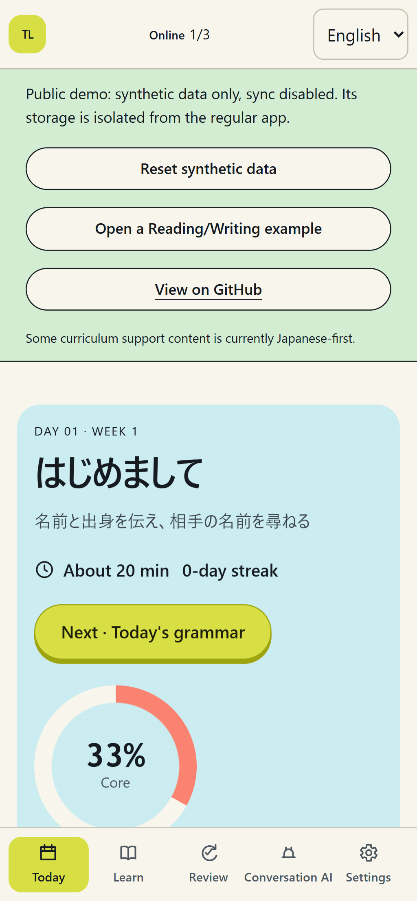
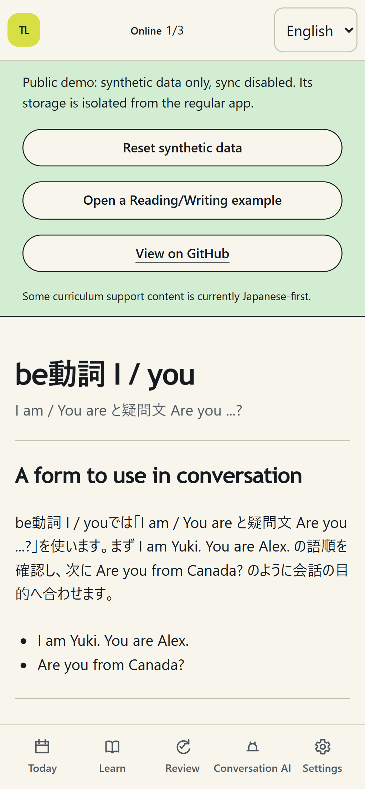
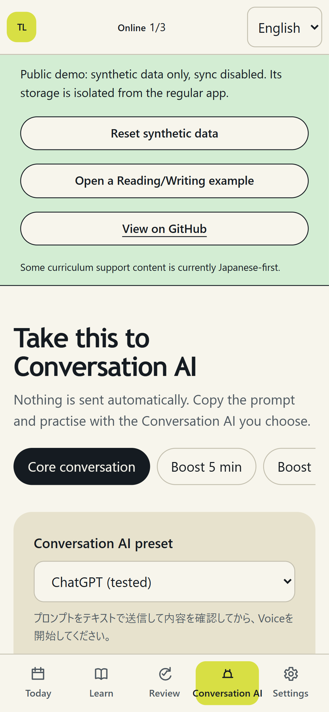
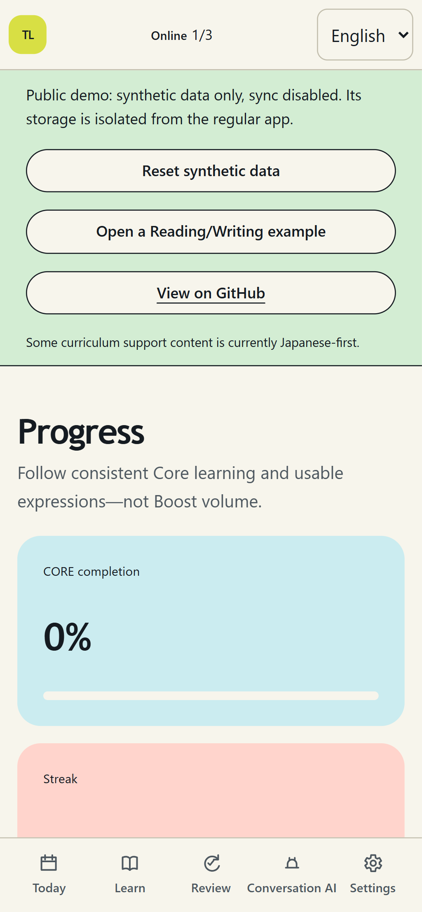
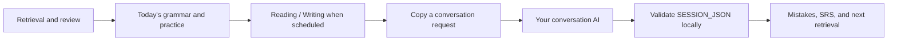
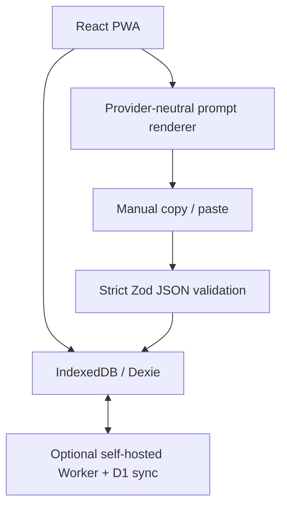

# Trellune

**A local-first, 365-day English-learning PWA.**

Trellune gives a learner a structured curriculum, spaced retrieval, grammar and
vocabulary practice, reading and writing, feedback and retry, assessment, and
learning history. It is **not another AI chat wrapper**: you bring the
conversation AI you already use, copy a lesson request, and paste validated
results back into the app. No AI API key is required.

[Try the demo](https://trellune-demo.pages.dev) · [See how it works](#how-it-works) ·
[Run locally](#run-locally) · [Contribute](CONTRIBUTING.md)

| Today                                                                                                      | Grammar and practice                                                                              |
| ---------------------------------------------------------------------------------------------------------- | ------------------------------------------------------------------------------------------------- |
|  |           |
| Conversation-AI request                                                                                    | Progress and retrieval                                                                            |
|           |  |

All images are captured from the resettable synthetic demo. They contain no
learner data, account information, production hostname, or private browser
state. The product UI is English here; curriculum support content is currently
Japanese-first. See the [Japanese README](README.ja.md) for Japanese UI images.

## Why Trellune?

- **365 days, intentionally bounded:** Four CEFR-informed stages—Foundation,
  Independent, Fluency, and B2 Challenge. Days 366–540 remain intentionally
  inactive.
- **Local-first and offline-capable:** Learning data lives in IndexedDB; core
  screens remain available after they have been cached.
- **A complete practice loop:** Retrieval, grammar transfer, productive
  vocabulary, Reading/Writing Labs, authored feedback, self-review, retry, and
  authentic conversation are explicit steps.
- **Bring your own conversation AI:** ChatGPT, Claude, Gemini, and a generic
  manual copy/paste preset. Trellune does not call or automate provider APIs or
  websites.
- **Optional self-hosted sync:** A Cloudflare Worker and D1 deployment can sync
  devices, but local learning never needs a Cloudflare account.

> The curriculum is designed for sustained A1-to-B1+ progress and a spoken
> B2-entry challenge. Completing Day 365 is not a CEFR certification. Any
> graduation result is an evidence-based estimate, not a credential.

## Try the synthetic demo

[Open the Trellune demo](https://trellune-demo.pages.dev). It uses only
resettable synthetic local data, has no sign-in, and never connects to D1 or the
optional sync service. Start Day 1, open a Reading/Writing sample, copy a
conversation request, preview a fixture import, or reset the synthetic state.

If the project is useful, a [GitHub star](https://github.com/qa-marmot/trellune)
helps other local-first language learners find it.

## How it works



1. Trellune shows the next deliberate-practice task and tracks Core learning.
2. You copy its provider-neutral lesson request into your normal conversation
   AI chat. Send it as text first; start Voice only when appropriate.
3. After the conversation, request `SESSION_JSON`, paste it into Trellune, and
   review strict validation before anything is saved.

The application is the trust boundary: malformed output, unknown fields, future
days, and acquisition-limit violations are rejected locally. The ChatGPT preset
has manual evidence; other presets remain explicitly unverified until a
maintainer records their acceptance evidence.

## Run locally

```bash
git clone https://github.com/qa-marmot/trellune.git
cd trellune
corepack enable
pnpm install --frozen-lockfile
pnpm db:migrate:local
pnpm db:seed:local
pnpm dev
```

Open the printed local URL and start Day 1. No Cloudflare login, remote database,
or AI API key is needed. [Local setup](docs/LOCAL_SETUP.md) documents the safe
reset boundary and optional self-hosted sync.

## Contribute

There are small, useful paths for documentation, localization, provider
verification, Safari/iPhone QA, accessibility, curriculum QA, application code,
and sync/security-sensitive work. Start with the lightweight
[contribution guide](CONTRIBUTING.md) and
[first-contribution guide](docs/FIRST_CONTRIBUTION.md); both say exactly which
files, knowledge, and checks are useful for each path.

Open questions and ideas belong in [GitHub Discussions](https://github.com/qa-marmot/trellune/discussions).
Specific, reproducible work belongs in [Issues](https://github.com/qa-marmot/trellune/issues).

## Language support

Trellune’s product UI is available in **Japanese** and **English**. The display
language is a per-device preference and never changes learner data, sync, or
JSON contracts. The 365-day curriculum’s support explanations and Japanese
glosses are still Japanese-first; Trellune does not claim a fully multilingual
curriculum yet. [Localization](docs/LOCALIZATION.md) explains the support matrix
and how to contribute another UI locale.

## Architecture and stable contracts



The stable contracts are `SESSION_JSON` 1.0, `ASSESSMENT_JSON` 1.0, backup v2,
sync protocol v1, and Dexie v5. Required Core learning remains distinct from
optional Boost learning.

## Verify a change

For a typical contribution, start with the fast local check:

```bash
pnpm check:quick
```

Run only the focused test for the area you changed. Before a runtime release or
when a maintainer asks, use the full [test strategy](docs/TEST_STRATEGY.md),
including D1, PWA, and browser coverage. Regenerate public screenshots with
`pnpm screenshots`; they are always captured from the synthetic demo.

## Documentation

- [Japanese README](README.ja.md)
- [Local setup](docs/LOCAL_SETUP.md)
- [Provider-neutral conversation AI](docs/PROVIDER_INTEGRATION.md)
- [Curriculum](docs/CURRICULUM.md)
- [Offline and sync](docs/OFFLINE_SYNC.md)
- [Architecture](docs/ARCHITECTURE.md)
- [Security](docs/SECURITY.md)
- [Contributing](CONTRIBUTING.md)
- [First contribution](docs/FIRST_CONTRIBUTION.md)
- [Community and launch materials](docs/community/README.md)
- [Roadmap](ROADMAP.md)

## License

Trellune, its documentation, and its authored curriculum are available under
the [MIT License](LICENSE). Third-party package licenses remain those of their
respective authors.
