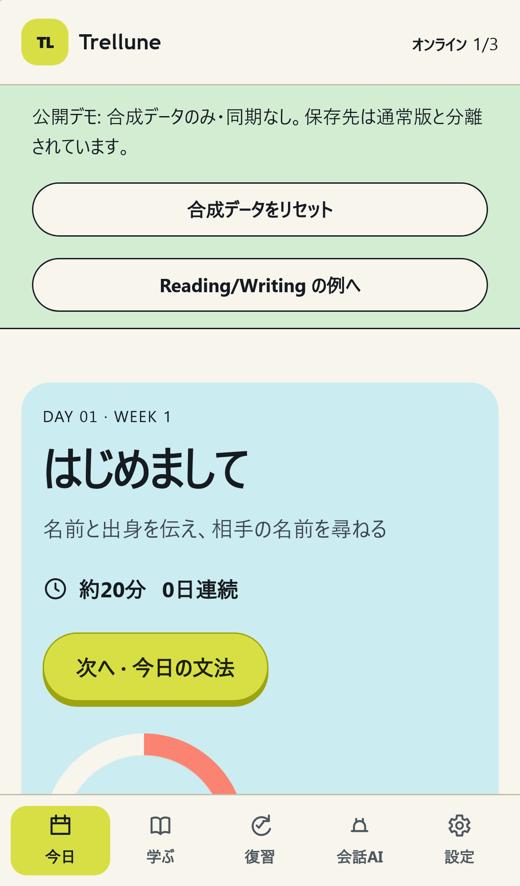
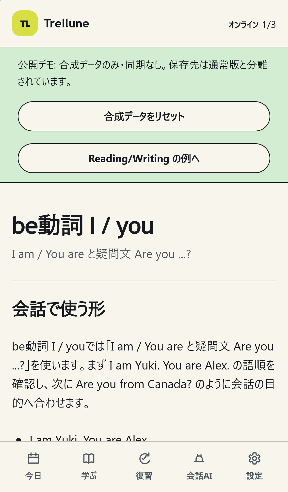
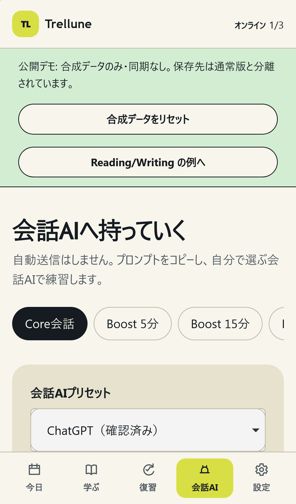
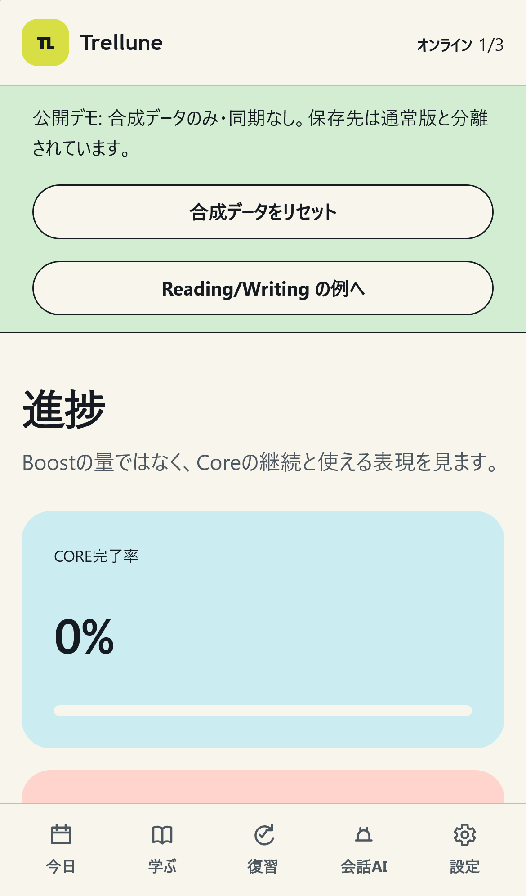
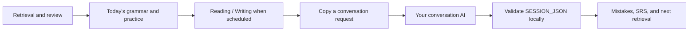
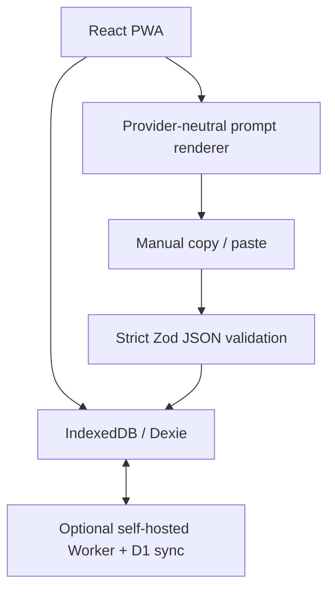

# Trellune

[](#why-trellune)
[](docs/PROVIDER_INTEGRATION.md)

**A local-first, 365-day language-learning PWA for deliberate practice and conversation.**

| Today                                                                                      | Grammar and practice                                                                 |
| ------------------------------------------------------------------------------------------ | ------------------------------------------------------------------------------------ |
|                   |  |
| Conversation-AI request                                                                    | Progress and retrieval                                                               |
|  |              |

All screenshots use the resettable synthetic demo; they contain no learner data.

Trellune combines spaced retrieval, Grammar transfer, productive Vocabulary,
Reading/Writing Labs, authored feedback and retry, and a manual conversation-AI
bridge. It requires no AI API key: copy a lesson request to the conversation AI
you choose, then paste its `SESSION_JSON` into Trellune for strict local validation.

> The curriculum is designed for sustained A1-to-B1+ progress and a spoken
> B2-entry challenge. Completing Day 365 is not a CEFR certification. Any
> graduation result is an evidence-based estimate, not a credential.

## Why Trellune?

- **365-day curriculum:** Four CEFR-informed stages—Foundation, Independent,
  Fluency, and B2 Challenge—while Days 366–540 remain intentionally inactive.
- **Local-first by default:** Learning data lives in IndexedDB and the app works
  offline after its essential screens are cached.
- **Bring your own conversation AI:** Manual copy/paste presets for ChatGPT,
  Claude, Gemini, or a generic provider. The app does not call or automate any
  provider API or website.
- **A learning loop, not a chat wrapper:** Retrieval, transfer, production,
  authored feedback, self-review, retry, spaced reuse, and authentic conversation
  stay separate and explicit.
- **Optional sync:** A self-hosted Cloudflare Worker and D1 deployment can sync
  devices. Local learning never needs a Cloudflare account.



## Try the synthetic demo

[Open the Trellune demo](https://trellune-demo.pages.dev). It uses only
resettable synthetic local data, has no sign-in, and does not connect to D1 or
the optional sync service.

## Try it locally

```bash
git clone https://github.com/qa-marmot/trellune.git
cd trellune
corepack enable
pnpm install --frozen-lockfile
pnpm db:migrate:local
pnpm db:seed:local
pnpm dev
```

Open the printed local URL and start Day 1. No Cloudflare login, remote database,
or AI API key is needed. See [Local setup](docs/LOCAL_SETUP.md) for the safe
reset boundary and optional self-hosted sync.

## How the conversation bridge works

1. Choose a conversation-AI preset and copy the lesson request.
2. Paste it into your provider's normal text conversation.
3. Start Voice only if that provider and environment support it.
4. Explicitly request `SESSION_JSON` after the conversation.
5. Paste the JSON into Trellune and review strict validation before saving.

The application is the trust boundary: it rejects malformed output, unknown
fields, future days, and acquisition-limit violations. ChatGPT is the manually
verified preset; other presets remain explicitly unverified until a maintainer
records their acceptance evidence. See [Provider integration](docs/PROVIDER_INTEGRATION.md).

## Architecture and contracts



The stable contracts are `SESSION_JSON` 1.0, `ASSESSMENT_JSON` 1.0, backup v2,
sync protocol v1, and Dexie v5. Required Core learning remains distinct from
optional Boost learning.

## Verify a change

```bash
pnpm prompts:check
pnpm docs:check-links
pnpm public:check
pnpm format:check
pnpm lint
pnpm typecheck
pnpm test
pnpm build
pnpm audit --prod
pnpm test:d1:local
pnpm test:pwa:update
pnpm playwright test
```

## Documentation

- [Japanese README](README.ja.md)
- [Local setup](docs/LOCAL_SETUP.md)
- [Provider-neutral conversation AI](docs/PROVIDER_INTEGRATION.md)
- [Curriculum](docs/CURRICULUM.md)
- [Offline and sync](docs/OFFLINE_SYNC.md)
- [Architecture](docs/ARCHITECTURE.md)
- [Security](docs/SECURITY.md)
- [Contributing](CONTRIBUTING.md)
- [Public-release checklist](docs/PUBLIC_RELEASE_CHECKLIST.md)
- [Provider acceptance pack](docs/provider-acceptance/README.md)
- [Launch copy](docs/LAUNCH.md)

## License

Trellune, its documentation, and its authored curriculum are available under
the [MIT License](LICENSE). Third-party package licenses remain those of their
respective authors.
