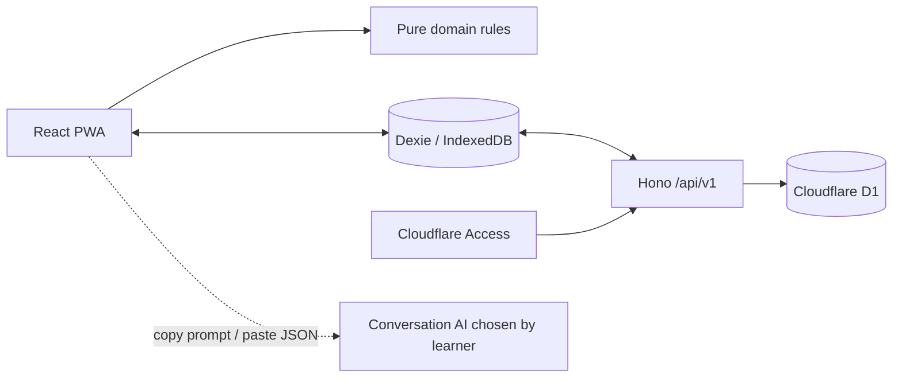

# Architecture

## System boundary

Trellune is a single-learner, mobile-first PWA. React renders the local-first interface, Dexie/IndexedDB is the offline working store, and a Hono Worker exposes the authenticated synchronization boundary. D1 is the server-side recovery and multi-device store. Conversation AI is outside the application boundary: the app only creates copyable prompts and accepts pasted JSON that is validated locally and again by the Worker. No AI API, automated provider submission, or audio storage is present.

## Layering

- `src/lib/schemas.ts`: strict Zod schemas at the external JSON and HTTP boundary. Parsed output, not unchecked input, enters the domain.
- `src/domain/`: environment-independent rules and exported types. Daily limits, Core completion, item states, and Boost recommendations live here so both UI and Worker use one definition.
- `src/worker/app.ts`: Hono routing, authentication gate, body-size/media-type handling, validation, and safe HTTP errors.
- `src/worker/d1.ts`: parameterized D1 statements and transaction batches. Values and identifier arrays are bound; table-dependent paths select complete fixed allowlisted statements instead of assembling SQL.
- `migrations/`: numbered, forward-only schema changes. `db/seed.sql` is synthetic local data only.

The browser working database is IndexedDB schema version 5. It stores normalized profile/settings, progress, sessions, learning/acquisition/review events, cards, mistakes, grammar, assessments, outbox, conflicts, sync state and metadata. `localStorage` is read only by the one-time legacy migration and is not the continuing source of learning truth. Each user-visible success follows an awaited IndexedDB transaction, and `BroadcastChannel` invalidates read models across tabs. Confirmed device deletion clears normalized data, snapshots and legacy queue state while writing deletion/bootstrap markers in one IndexedDB transaction, then removes the legacy local-storage value. Startup and every synchronization commit recheck the durable marker inside their write transaction, so a blocked legacy-storage removal or response already in flight cannot silently rehydrate the just-deleted profile from D1.

Stage Assessment attempts use the existing IndexedDB `assessments` store and sync entity type, so IndexedDB remains schema version 5 and sync remains protocol version 1. `assessmentId` identifies the available definition; `attemptId` is the immutable attempt/entity identity. Definition-specific `requiredSkills` validates only the skills that assessment needs. Foundation evaluates grammar, vocabulary, speaking and interaction; Independent adds listening and fluency; Fluency evaluates extended speaking, interaction, fluency, integrated grammar, vocabulary and listening while keeping pronunciation optional. Graduation reuses those contracts and adds a required evidence-based `cefrEstimate` of B1+, B2-entry, or B2. The current integrated definition requires a concrete evidence note for each of eight skills and applies a score-profile guardrail: B2-entry requires every skill at least 3/5; B2 additionally requires `pass` and every skill at least 4/5. Legacy integrated and spoken/listening attempts remain valid. Assessment result, estimate, and content progression are independent: completion or pass does not award CEFR automatically, and provisional or reinforcement-recommended never blocks Core.

Curriculum capacity has three separate authorities: the client supports Day 1–540, this bundle contains Day 1–365, and migration `0012` can activate D1 `curriculum_catalog.active_total_days=365`. Bootstrap returns the server value. The client validates `ACTIVE <= AVAILABLE <= SUPPORTED` before hydration and stores the last compatible ACTIVE in existing IndexedDB metadata without changing schema version 5. Offline startup uses that last value, or AVAILABLE=365 when none has been observed. A mismatch uses the existing startup failure surface and cannot partially apply remote records. Day 90→91, Day 180→181, and Day 270→271 are derived from existing Core evidence; no bulk profile/progress migration or pre-created progress row is used.

## Core and Boost invariants

Core is complete only when due review, the day's grammar task, and a Core Voice import are all complete. `calculateCoreCompletion` is the canonical rule. Boost never sets `core_voice_imported`, never advances a curriculum day, and never completes a future Core day. Items acquired from Boost start as `previewed`; Core items start as `new`. Previewing does not convert a future lesson into completed Core work.

The service checks daily totals before an import and the database repeats enforcement with insert triggers: no more than eight vocabulary items, three phrases, and one preview grammar topic per learner and study date. Once a limit is reached, review and conversational work remain available.

## Import atomicity and idempotency

An import has three independent duplicate keys: the provider-supplied `sessionId`, a client-created `idempotencyKey`, and the SHA-256 of the original pasted source. An exact replay returns the prior import. Partial key reuse is a conflict and is not guessed or merged. Session, acquired items, review cards, progress, and change-log entry are sent as one D1 batch. The session mirror is guarded by `expectedVersion`; restoring a tombstoned session advances the parent and same-ID dependent mirrors instead of resetting them to version 1. The daily-progress side effect uses the same history-aware allocator and write guard as a direct progress restore. Database write guards, unique constraints and limit triggers are the final protection against concurrent requests.

## Failure model

IndexedDB remains usable when offline. A local write and its outbox record commit together; the worker deletes an outbox item only after an acknowledged response, and then pulls ordered changes into the validated local read model. Offline, retryable, authentication, rate-limit and version-conflict states remain distinct. Conflicts are preserved for explicit retry or resolution rather than silently overwritten. Validation errors keep original pasted text only in component memory. Only successful server writes enter the ordered change log.

Backup 2.0 exports normalized records, including optional Stage Assessment attempts, plus tombstones under a versioned, SHA-256-verified envelope. Older v2 backups without Stage Assessments remain valid, and new v2 backups round-trip them losslessly. Import is previewed and explicitly confirmed before one atomic replacement transaction. A restored sync-enabled dataset first inventories the remote snapshot and versions, reseeds restored entities, and queues tombstones for remote-only entities. For daily progress, the outbox keeps the remote version as the strict CAS predecessor and carries the backup version separately as a restore floor. D1 allocates above the authoritative maximum across physical, mirror/tombstone, payload and mutation/change history, then writes one matching version to every representation. Its durable reconciliation marker survives interrupted pagination and clears only after the final pull, empty outbox and conflict-free state; browser, fake-IndexedDB and real-D1 tests cover rollback, reload, remote-only data, interruption, stale conflict, retry and concurrent restore.

## Deployment boundary

The Worker must sit behind Cloudflare Access and the public `workers.dev` route must be disabled for deployed environments. The application verifies the Access JWT against the configured team-domain JWKS, issuer, audience, time claims and RS256 algorithm before deriving a learner identity. Each isolate uses a bounded TTL JWKS cache with concurrent-fetch deduplication; unknown keys force one refresh so rotation works, while stale/network/malformed/oversized results fail closed. Local header authentication requires both `ALLOW_LOCAL_AUTH=true` and a loopback request; that setting is prohibited in remote environments.
