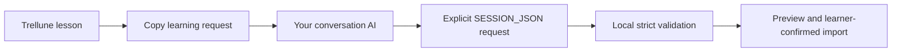

# Bring-your-own conversation AI

Trellune is manual-first. It does not call an AI API, automate a provider's
website, or store audio. It renders a provider-neutral learning request, the
learner copies it into a service they choose, and Trellune validates returned
`SESSION_JSON` locally before any learning data is saved.

## Capability presets

| Preset                  | Text       | Voice      | JSON       | System / Project / files                | Status                                    |
| ----------------------- | ---------- | ---------- | ---------- | --------------------------------------- | ----------------------------------------- |
| ChatGPT                 | tested     | tested     | tested     | tested / tested / tested                | tested manually with this workflow        |
| Claude                  | unverified | unverified | unverified | unverified / unverified / unverified    | capability must be checked by the learner |
| Gemini                  | unverified | unverified | unverified | unverified / unverified / unverified    | capability must be checked by the learner |
| Generic conversation AI | unverified | unverified | unverified | unsupported / unsupported / unsupported | no capability is assumed                  |

The table is a product compatibility statement, not a claim about a provider's
current product features. Only the ChatGPT preset has been acceptance-tested in
this repository. An unverified text-only provider can support self-study but is
not presented as a substitute for Voice/Listening Core work.

## Contract and trust boundary

`LearningConversationRequest` is provider-free: it contains a curriculum day,
objective, grammar focus, voice task, coaching, learner context, bounded Boost
settings, and an output instruction. Presets only add manual workflow wording.

`SESSION_JSON` remains version 1.0. The app accepts only strict schema-valid
data, rejects unknown fields, invalid dates/IDs, future curriculum days, and
acquisition-limit violations, and shows a preview before saving. Provider output
is never trusted merely because a model says it is correct.

## Using a provider

1. In **Conversation AI**, select a preset and copy the prompt.
2. Paste it into a normal text conversation and send it first.
3. If the selected service has suitable Voice capability, start Voice only after
   it has acknowledged the lesson context.
4. After the session, explicitly request `SESSION_JSON`.
5. Paste only the result into **Import conversation result JSON**, review the
   validation preview, then save it.

For ChatGPT-specific Project, Study Mode, Voice, and Scheduled Task setup, see
[`../chatgpt-project-sources/CHATGPT_MANUAL_SETUP.md`](../chatgpt-project-sources/CHATGPT_MANUAL_SETUP.md).
