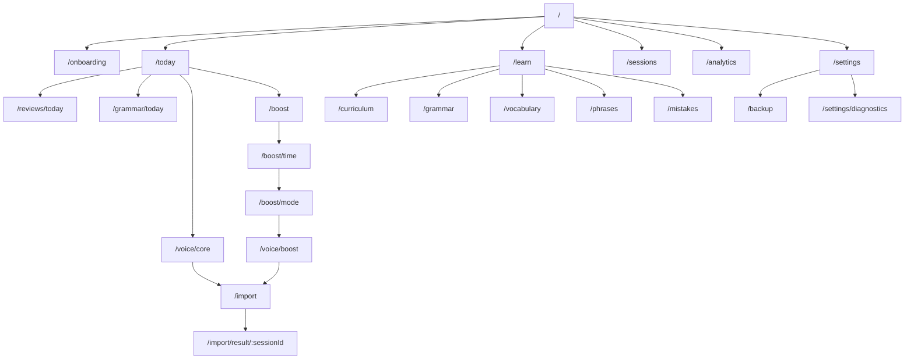

# 画面マップ

最終更新: 2026-08-06

## 1. 情報設計

モバイルの主要ナビゲーションは「Today」「学ぶ」「履歴」「分析」「設定」とする。BoostとChatGPT Bridgeは文脈依存フローであり、Coreとの混同を避けるためTodayから明示的に遷移する。深いリンクは認証、初期設定、対象データの存在を確認してから目的画面へ復帰する。

## 2. 画面一覧

| ID           | ルート                      | 目的               | 主要要素                                     | 主な状態                         |
| ------------ | --------------------------- | ------------------ | -------------------------------------------- | -------------------------------- |
| SCR-ONB-01   | `/onboarding`               | 製品説明           | ローカル優先、音声非保存、連携境界、開始     | 初回/再表示                      |
| SCR-ONB-02   | `/onboarding/profile`       | 初期設定           | タイムゾーン、開始日、目安時間、自己評価     | empty/invalid/saving/error       |
| SCR-BASE-01  | `/baseline`                 | ベースライン       | 説明、プロンプト、コピー、取込、後で         | clipboard denied/import error    |
| SCR-TDY-01   | `/today`                    | 今日の司令塔       | 日付、接続/同期、Core進捗、3必須要素、Boost  | loading/offline/partial/complete |
| SCR-REV-01   | `/reviews/today`            | 必須復習           | 残数、カード、回答、自己評価、中断           | none/in progress/saving/done     |
| SCR-GRM-01   | `/grammar/today`            | 今日の文法         | 説明、例、問題、エラー、完了                 | loading/answering/pass/offline   |
| SCR-VOICE-01 | `/voice/core`               | Core Voice準備     | 目標、話題、プロンプト、コピー、取込へ       | ready/copied/clipboard error     |
| SCR-BST-01   | `/boost`                    | Boost Hub          | Core条件、推奨、残り新規枠、開始             | locked/ready/recommended         |
| SCR-BST-02   | `/boost/time`               | 時間選択           | 5/15/30/60分、目安内容                       | selected                         |
| SCR-BST-03   | `/boost/mode`               | モード選択         | 7モード、推奨理由、自由選択                  | selected/limit reached           |
| SCR-VOICE-02 | `/voice/boost`              | Boost準備          | 時間、モード、目標、プロンプト、コピー       | ready/copied/error               |
| SCR-IMP-01   | `/import`                   | JSON貼り付け・検証 | 原文、クリップボード、用途、検証             | empty/parsing/errors/valid       |
| SCR-IMP-02   | `/import/preview`           | 取込確認           | 差分、警告、カード、上限、種別、確定         | warning/conflict/submitting      |
| SCR-IMP-03   | `/import/result/:sessionId` | 結果               | 成功/重複、Core影響、次の行動                | success/duplicate/failure        |
| SCR-CUR-01   | `/curriculum`               | 365日一覧          | Stage、Unit、週、日、状態、進捗              | loading/offline/empty            |
| SCR-CUR-02   | `/curriculum/day/:day`      | 日詳細             | テーマ、文法、語彙、表現、会話目標           | locked/current/previewed/done    |
| SCR-GRM-02   | `/grammar`                  | 文法一覧           | 検索、状態、トピック                         | empty/results/offline            |
| SCR-GRM-03   | `/grammar/:id`              | 文法詳細           | 解説、例、関連ミス、復習                     | normal/previewed                 |
| SCR-VOC-01   | `/vocabulary`               | 単語一覧           | 検索、習得状態、期限、並べ替え               | empty/results                    |
| SCR-VOC-02   | `/vocabulary/:id`           | 単語詳細           | 意味、例、履歴、次回期限                     | active/previewed                 |
| SCR-PHR-01   | `/phrases`                  | 表現一覧           | 検索、習得状態、期限                         | empty/results                    |
| SCR-PHR-02   | `/phrases/:id`              | 表現詳細           | 意味、用法、例、履歴                         | active/previewed                 |
| SCR-MIS-01   | `/mistakes`                 | 間違いノート       | 分類、回数、最終発生、弱点導線               | empty/results                    |
| SCR-MIS-02   | `/mistakes/:id`             | 間違い詳細         | 例、修正、関連セッション、練習               | active/resolved                  |
| SCR-SES-01   | `/sessions`                 | セッション履歴     | 日付/種別/モード絞り込み                     | loading/empty/partial sync       |
| SCR-SES-02   | `/sessions/:id`             | セッション詳細     | 評価、ミス、カード、取込情報                 | found/missing                    |
| SCR-ANA-01   | `/analytics`                | 進捗分析           | Core、連続、期限切れ、習得、弱点             | no data/range/offline            |
| SCR-BCK-01   | `/backup`                   | 書出・復元         | 説明、作成、ファイル選択、復元               | generating/validating/error      |
| SCR-BCK-02   | `/backup/restore-preview`   | 復元確認           | 追加/更新/競合、確認、適用                   | invalid/conflict/applying        |
| SCR-SET-01   | `/settings`                 | 設定               | タイムゾーン、表示、同期、端末削除二段階確認 | saving/error/confirming          |
| SCR-DIA-01   | `/settings/diagnostics`     | 診断               | app/schema/contract版、接続、同期、コピー    | online/offline/error             |
| SCR-OFF-01   | `/offline`                  | 未取得ページの案内 | オフライン説明、Today/取得済み画面、再試行   | offline only                     |
| SCR-ERR-01   | `*`                         | Not Found/障害     | 説明、復帰、相関ID、再試行                   | 404/runtime/API                  |

## 3. 共通コンポーネント契約

### App shell

- ページ先頭へのスキップリンク、現在位置を示すナビゲーション、1ページ1つの`h1`を持つ。
- オフライン、同期中、未同期、競合、更新可能を色だけでなくテキストで通知する。
- トーストだけに重要情報を置かない。`aria-live`は重要度に応じて使い分け、連続通知を抑制する。

### フォーム

- 各入力に可視ラベル、形式例、エラー要約とフィールドエラーを持つ。
- エラー時は先頭のエラーへフォーカスを移し、入力値を保持する。
- 保存/取込中の多重送信を抑止し、無効化理由を読み上げられる。

### 確認ダイアログ

- 取込、復元、削除など影響のある操作だけに用いる。
- 初期フォーカス、Escape、背景非操作、フォーカストラップ、終了後の起点復帰を実装する。
- 破壊操作のボタン名は「はい」ではなく具体的な動詞にする。

### 状態表示

- `previewed`、Core/Boost、必須/任意、同期済み/未同期をバッジ文言でも識別する。
- スケルトンには読み上げ可能な読込中表示を併設する。
- グラフには同等の表または要約を併設する。

## 4. レスポンシブとアクセシビリティ

- 320 CSS pxから主要フローを完遂できる。下部固定ナビが入力やエラーを覆わない。
- タップ対象は原則44×44 CSS px以上。隣接する危険操作には十分な間隔を取る。
- PC幅では補助ナビを表示してよいが、モバイルと同じURL・見出し階層・機能を保つ。
- 横向き、ソフトウェアキーボード表示、safe-area insetを考慮する。
- フォーカス順はDOM順に一致し、正の`tabindex`を使わない。

## 5. ルートガード

- 未初期設定: 深いリンクの目的URLを保持してonboardingへ移動し、完了後に復帰する。
- 未認証の同期API: ローカル機能は可能な限り維持し、Access認証が必要な同期だけを案内する。
- Core未完了のBoost: `/boost`で未完了理由を示し、時間・モード以降へ進めない。
- 存在しない/未同期ID: 404と未同期の可能性を区別し、一覧/同期再試行へ案内する。
- オフライン未取得: `/offline`へ遷移し、取得済み画面と再試行を提示する。
