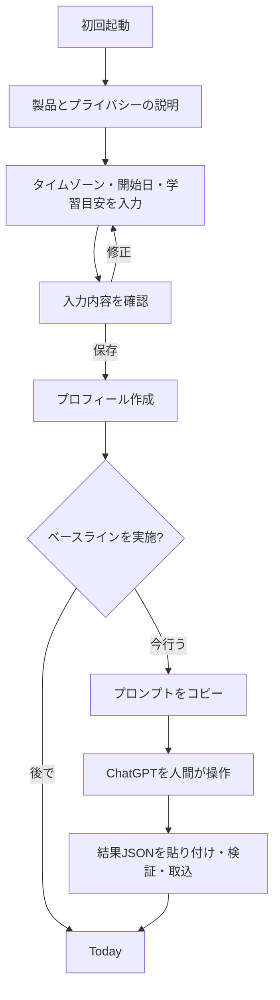
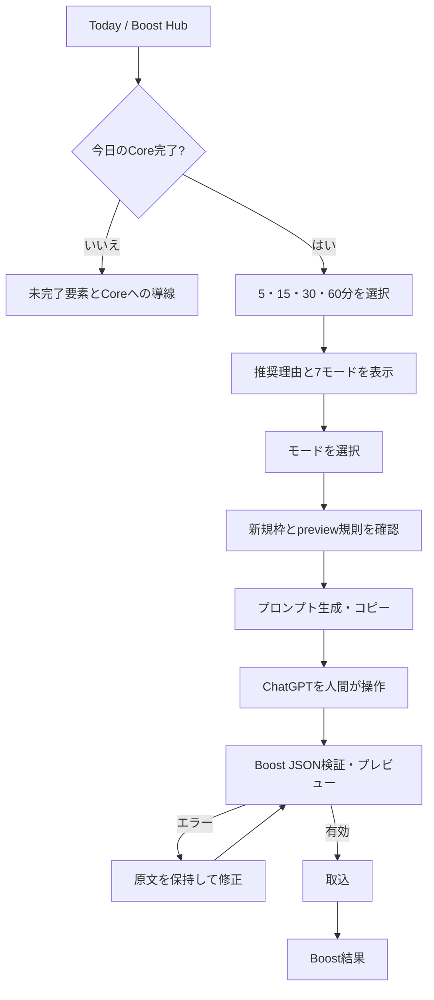

# ユーザーフロー

最終更新: 2026-08-06

## 共通ルール

- すべてのフローで、読込中、空、成功、入力エラー、通信エラー、権限拒否、競合、オフラインを明示する。
- 破壊・永続化・取込の直前には、影響を確認できる画面を置く。
- 戻る、再読込、アプリ終了後の再開で、確定済みデータを失わない。未確定の貼り付け原文は取込画面を開いている間だけ保持する。
- CoreとBoostはルート、見出し、セッション種別、永続化イベントのすべてで区別する。

## UF-01 初回利用

例外:

- 保存に失敗した場合は入力を保持し、再試行と診断導線を示す。
- クリップボード拒否時はプロンプト本文を選択可能にし、結果は直接貼り付けできる。
- ベースライン結果が不正な場合はプロフィールを巻き戻さず、後から再開できる。

## UF-02 毎日のCore

1. Todayを開き、学習日、同期状態、必須復習数、文法、Voiceの未完了理由を確認する。
2. 「期限が来た復習」を開始し、各カードを自己評価する。中断時は完了済み回答を保持する。
3. 今日の文法を読み、問題へ回答する。合格条件を満たすまで修正・再挑戦する。
4. Core Voice準備を開き、今日の目標を確認してプロンプトをコピーする。
5. 利用者がChatGPT Voiceを別画面で実施する。Trelluneは音声を送信・保存しない。
6. ChatGPTが返したJSONをTrelluneへ貼り付ける。
7. 抽出・スキーマ・種別・日付・上限・重複を検証し、変更プレビューを確認する。
8. 明示的に取り込み、3要素が揃ったときだけCore完了となる。
9. Todayへ戻り、完了表示と連続日数を確認する。

重要な分岐:

- 必須復習0件なら復習要件は満たすが、文法とVoiceは必要。
- Boost JSONを貼った場合は種別不一致として保存しない。
- 重複なら既存セッションへの導線を示し、カードや連続日数を増やさない。
- 日付が変わった場合、どの学習日に取り込むかを契約規則で判定し、曖昧なら利用者に修正を求める。

## UF-03 Boost

- 期限切れ復習が多ければReview Rescue、同一ミス3回以上ならWeakness Attackを上位にするが、選択を強制しない。
- Next Lesson Previewは未来教材を`previewed`で登録する。未来日のCoreカードを完了にしない。
- 新規枠が0でも、復習・会話・既存項目へのフィードバックを続けられる。
- Boostを実施しない選択に警告や失敗表示を出さない。

## UF-04 JSON取込の安全フロー

1. 用途（Core/Boost/ベースライン/週次）を選んだ状態で取込画面を開く。
2. 直接貼り付けるか、ボタン操作でクリップボードを読む。
3. 「検証」を選択する。自動保存しない。
4. 抽出結果が1つでなければ、候補と理由を示して修正を求める。
5. Zod検証エラーをJSONパス別に表示する。原文と編集用コピーを切り替えられる。
6. 有効なら、作成/更新/無変更、カード、ミス、上限消費、Core/Boost判定をプレビューする。
7. 利用者が「取り込む」を選ぶ。多重押下を無効化し、原子的に保存する。
8. 成功時はセッションID、結果、次の行動を表示する。失敗時は原文を保持し、部分更新がないことを伝える。

禁止される近道:

- 構文エラーを推測して補完しない。
- 列挙値や欠落値を暗黙の初期値で保存しない。
- 超過新規項目を黙って切り捨てない。
- 同じIDの内容差し替えを更新扱いにしない。

## UF-05 オフライン学習と再同期

1. 接続喪失を検出すると、控えめだが常時認識できるオフライン表示を出す。
2. 対応操作はIndexedDBへ保存し、一意な操作ID付きで同期キューへ追加する。
3. 非対応操作には通信が必要な理由を示し、入力を失わず再試行可能にする。
4. 再接続時は自動同期を開始する。利用者は未同期数と進行状態を確認できる。
5. 認証切れはログイン導線、競合は差分と解決選択、再試行可能エラーはバックオフ後の再試行を示す。
6. 完了後、サーバーackを受けた操作だけをキューから除き、集計と不変条件を再計算する。

複数端末競合では、上限やCore状態を壊す単純なlast-write-winsを使わない。イベントIDの重複除去後、ドメイン規則に基づく決定的統合を行い、解決不能項目だけを利用者に提示する。

## UF-06 履歴・分析・弱点から学ぶ

1. 分析でCore完了、連続日数、期限切れ、語彙/表現/文法、弱点を確認する。
2. グラフは同じ情報を表またはテキストでも提供する。
3. 弱点を選択し、関連ミスとセッション詳細を確認する。
4. Core完了後ならWeakness AttackのBoost設定へ引き継ぐ。
5. 履歴へ戻っても絞り込み、スクロール位置、選択期間を合理的な範囲で保持する。

## UF-07 バックアップ

1. Backup画面で、含まれるデータ、含まれないデータ、ファイル管理上の注意を読む。
2. 「バックアップを作成」を選び、ローカルDBの整合したスナップショットを生成する。
3. ダウンロード成功と作成日時を確認する。ファイル自体をアプリ外へ自動送信しない。

## UF-08 復元

1. ファイル選択前に「現在データは確認までは変更されない」と説明する。
2. ファイルを選択し、形式・版・構造・上限・参照整合性・サイズを検証する。
3. 追加/更新/競合/対象外をプレビューする。
4. 影響を理解した確認チェックと実行ボタンで適用する。
5. トランザクション失敗時は既存データを保持する。成功後は集計を再構築し、同期状態を表示する。

## UF-09 PWA更新

1. 新しいservice workerを検出しても、学習途中で強制再読込しない。
2. 「更新可能」と変更概要、保存状態を表示する。
3. 利用者が更新を選ぶと、保留中入力がないことを確認してworkerを切り替え、再読込する。
4. DBマイグレーションに失敗した場合は旧データを保持し、復旧案内を表示する。

## UF-10 データ削除

1. 設定で「この端末」の削除対象、未送信操作を含むこと、同期済みD1は対象外であることを確認する。
2. バックアップ推奨と不可逆性を読み、確認チェックを入れる。
3. 指定文言「端末データを削除」を入力した場合だけ削除ボタンを有効にする。
4. 端末内の正規化データ、旧snapshot/queue、旧localStorageを一括削除し、D1削除mutationは送らない。削除マーカーにより直後の自動D1復元を防ぐ。
5. 成功後はonboardingへ戻す。同期済み本番データの削除はUIから自動実行せず、本人確認と本番操作承認フローを通す。
